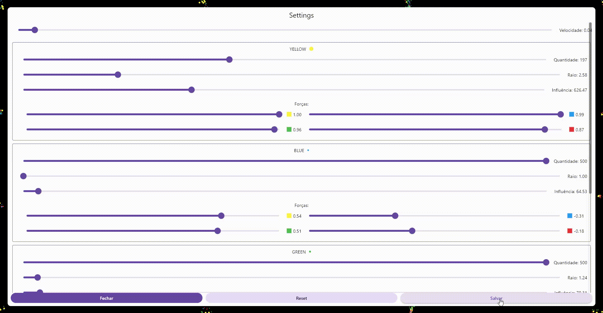

# Particles

    

A project for simulating particles using Newton's second law with universal gravitation, applying the polar coordinate system to calculate the force applied between each particle in the form of acceleration force.

The project is built upon the proposal by Hunar4321 [https://github.com/hunar4321/particle-life], where each particle receives an area of influence sphere and a force relationship with each type of particle in the simulation.

Thus, a particle can attract or repel particles within its sphere of influence.

## The Code

The project is developed using Flutter with Dart for the graphical interface and particle simulation.

Flutter already has a screen update loop, and we could use its features with Tickers and Canvas to draw particles on each frame, as I have shown in other studies [https://www.linkedin.com/posts/activity-7028092287859441664-DQfE?utm_source=share&utm_medium=member_desktop].

However, for this project, I chose to use the Flame package [https://pub.dev/packages/flame], which creates a game engine for Flutter, making it easier to work with the update loop and already has various components such as Sprites, Collisions, etc.

## The Particle

Each particle has a radius of influence; other particles within this radius are affected. Each particle has a force ranging from -1 to 1 concerning each other type of particle.

## The Calculation

Each frame, each particle calculates the forces on the X and Y axes that are influencing it, passing through each other present particle.
For this, the distance between the two particles is calculated, and Kepler's problem is used along with a simplified polar solution: force = G / distance, where G is the relative force between the two types of particles.

With the directional force, it is applied to a velocity constant and the particle's position is updated.

If the particle reaches the edge of the "screen," its velocity is reversed, causing it to be reflected by the screen's edges.

## Customizations

Using the settings button, the following can be configured:

- Velocity constant
- Number of particles
- Particle size
- Size of the influence sphere
- Force between types of particles

## Objectives

Particle simulation provides various scenarios of interest, from atomic behaviors to movement and cellular life formation.

## Examples

Some notable simulations:

Atomic Nucleus:

Chaos:

Grid:

Cells chasing:

Nuclear organization:

Red pursuit:

## Running the Project

The project can be executed on any Flutter platform; however, it is a project that requires graphical processing due to the simulation, so the more powerful the device, the better the performance with more particles.

The web environment is particularly problematic for simulations with more than 400 particles.

Website: [https://lifeparticles.web.app/]
