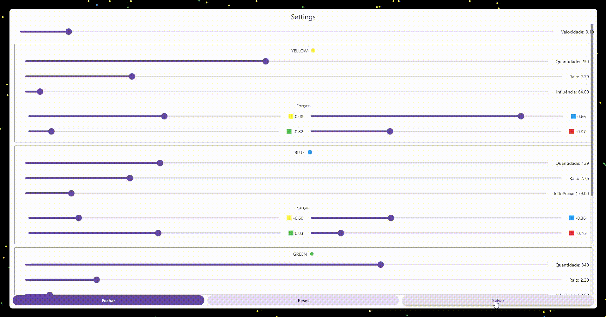

# Particles

Um projeto para simulação de partículas utilizando a segunda lei de Newton com lei da gravitação universal, aplicando o sistema polar de coordenas para calcular a força aplicada entre cada partícula em forma de força de aceleração.

O projeto é feito em cima da proposta de Hunar4321[https://github.com/hunar4321/particle-life] no qual cada partícula recebe área de esfera de influência e uma relação de força em relação a cada tipo de partícula na simulação.

Deste modo uma partícula pode atrair ou repelir as partículas dentro de sua esfera de influência.

## O código

O projeto é feito utilizando o Flutter com o Dart para desenvolvimento da interface gráfica e simulação das partículas.

O Flutter já possui um loop de atualização de tela e poderíamos usar seus recursos com Tickers e o Canvas para desenhar as partículas a cada frame como já mostrei em outros estudos[https://www.linkedin.com/posts/activity-7028092287859441664-DQfE?utm_source=share&utm_medium=member_desktop].

Contudo para este projeto optei por utilizar o package Flame[https://pub.dev/packages/flame] que cria uma engine de jogos para Flutter, que facilita trabalhar com o loop de update bem como já possui diversos componentes como Sprites, Collisions etc.

## A Partícula

Cada partícula possui um raio de influência, outras partículas dentro desse raio são afetadas.
Cada partícula possui uma força que varia entre -1 a 1 em relação a cada outro tipo de partícula.

## O cáculo

A cada frame, cada partícula calcula as forças nos eixos X e Y que a estão influênciando, passando por cada outra partícula presente.
Para isso é calculado a distância entre as duas partidas e utilizada o problema de Kepler e a solução polar com uma simplificação: força = G / distância, onde G é a força relativa entre os dois tipos de partículas.

Com a força direcional ela aplicada a uma constante de velocidade e atualizado a posição da partícula.

Se a partícula atinge o final da "tela" sua velocidade é invertida fazendo com que ela seja refletida pelas bordas da tela.

## Customizações

Utilizando o botão de settings pode ser configurado:

- Constante de velocidade
- Quantidade de partículas
- Tamanho da partícula
- Tamanho da esfera de influência
- Força entre tipos de partículas

## Objetivos

A simulação de partículas proporciona diversos cenários de interesse, desde comportamentos atômicos até movimento e formação de vida celular.

## Exemplos

Algumas simulações notórias:

Nucleo Atomico:

Caos:

Grid:

Celulas perseguindo:

Organização nuclear:

Perseguição vermelha:

## Para rodar o projeto

O projeto pode ser executado em qualquer plataforma do Flutter, contudo é um projeto que exige processamento gráfico por conta da simulação, logo quanto mais potente o dispositivo melhor será a performance com mais partículas.

O ambiente web é especialmente problemático para simulações com mais de 400 partículas.
